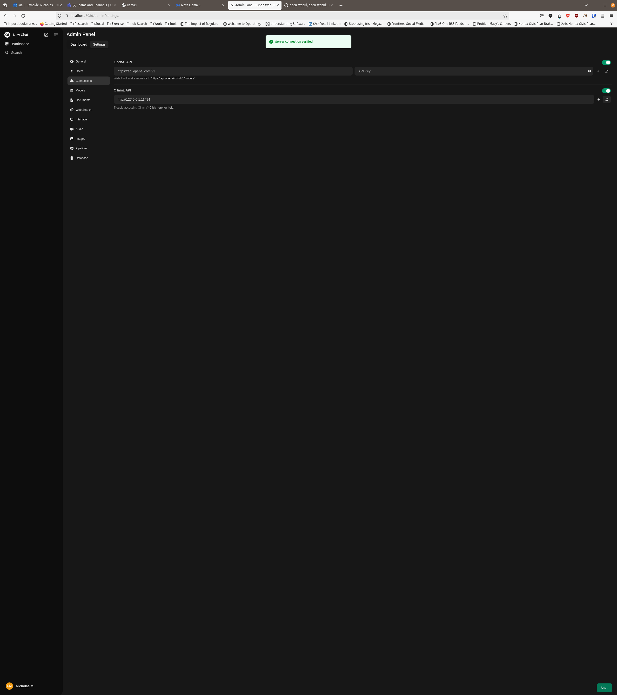

# Creative Writing Through Hybrid AI Collaboration

> A research project in collaboration with the LUC Psychology Department.

## Table of Contents

- [Creative Writing Through Hybrid AI Collaboration](#creative-writing-through-hybrid-ai-collaboration)
  - [Table of Contents](#table-of-contents)
  - [About](#about)
  - [Installing Required Software](#installing-required-software)
    - [System Environment](#system-environment)
    - [Install Docker](#install-docker)
    - [Install Ollama](#install-ollama)
    - [Install Llama 3 in Ollama](#install-llama-3-in-ollama)
    - [Install Open WebUI](#install-open-webui)
  - [Configuring Open WebUI](#configuring-open-webui)

## About

This repository contains the files and steps required to setup the technical
aspects of the software suite for this research.

Currently, this research leverages [Ollama](https://github.com/ollama/ollama)
and [Open WebUI](https://github.com/open-webui/open-webui) to provide a local,
controlled AI environment where researchers can monitor, evaltuate, and analyze
user quieries and AI responses.

## Installing Required Software

We leverage Docker in order to abstract away the hardware platform to use as
well as control for technical variables such as software versions, and
availibility of tools.

### System Environment

This environment was tested to work on x86-64 Linux.

### Install Docker

Up to date instructions on how to install the Docker Engine are provided
[here](https://docs.docker.com/engine/install/).

### Install Ollama

Ollama provides an HTTP server and REST API wrapper around the high-performance
[llama.cpp](https://github.com/ggerganov/llama.cpp) inference engine.

Instructions to add NVIDIA or AMD GPU support are described here
[here](https://hub.docker.com/r/ollama/ollama).

Ollama (with GPU support) can be installed as a Docker container with:

```shell
docker run -d --gpus=all -v ollama:/root/.ollama -p 11434:11434 --name ollama ollama/ollama
```

Further configurations to install Ollama via Docker are described
[here](https://hub.docker.com/r/ollama/ollama).

### Install Llama 3 in Ollama

[Llama3](https://llama.meta.com/llama3/) is a LLM provided by Meta that can be
ran with Ollama.

To install Llama 3, run:

```shell
docker exec -it ollama ollama pull llama3
```

Other Ollama compatible models are provided [here](https://ollama.com/library).

### Install Open WebUI

[Open WebUI](https://github.com/open-webui/open-webui) is a web interface
similar to OpenAI's ChatGPT interface that allows for inferencing with Ollama
and OpenAI models.

To install Open WebUI, run:

```shell
docker run -d --network=host -v open-webui:/app/backend/data -e OLLAMA_BASE_URL=http://127.0.0.1:11434 --name open-webui --restart always ghcr.io/open-webui/open-webui:main
```

## Configuring Open WebUI

- After installing Open WebUI, you can access the application by visiting
  [http://localhost:8080](http://localhost:8080)


- Create a new account by clicking *Sign up*


- Click your user icon in the top left corner


- Click *Admin Panel*, then click the *Settings* button


- Click *Connections*, then ensure that the *Ollama API* is set to
  [http://127.0.0.1:11434](http://127.0.0.1:11434) and click the *Verify
  Connection* (the left most icon to the text box) icon to verify the
  connection.



- Click *New Chat* in the top right, then click the *Select a model* dropdown
  and chooses *llama3:latest 8.0B*


